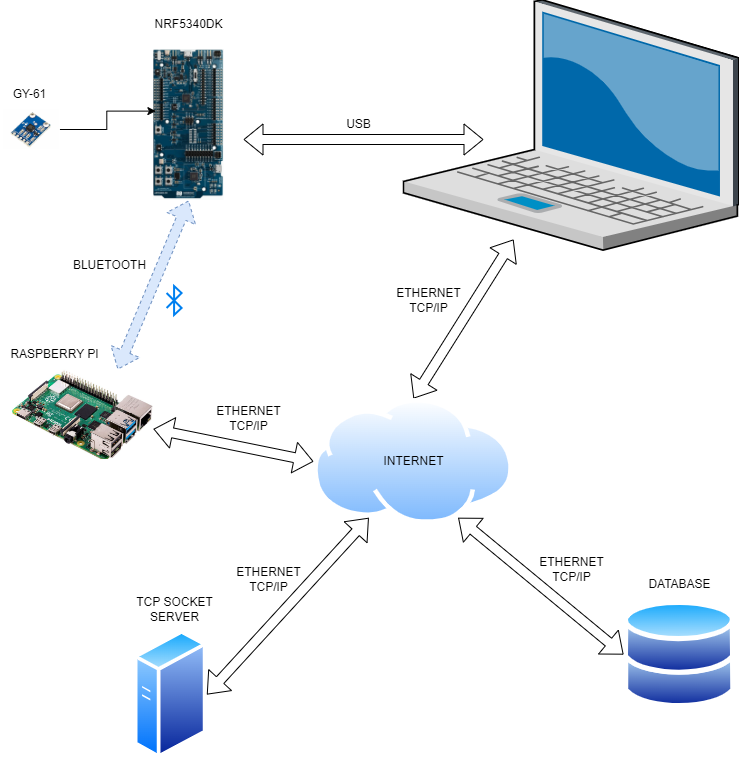
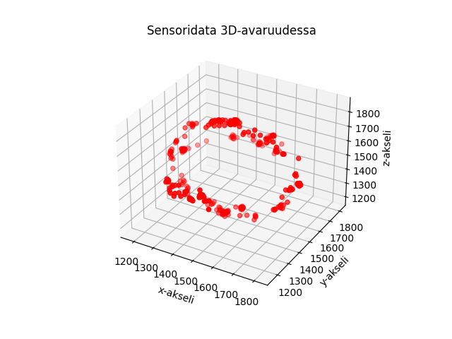
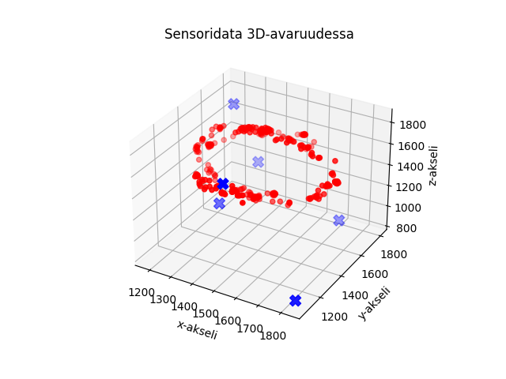
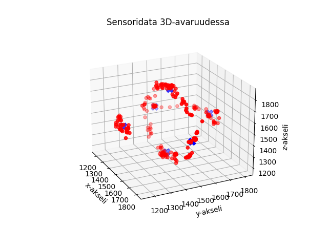

# Tietoliikenteen sovellusprojekti
Projektissa tehtävänä on suunnitella Nordic NRF5340 DK -alustalle ohjelma, joka mittaa kiihtyvyysanturidataa (GY-61) ja välittää tietoa langattomasti IoT-reitittimelle (Raspberry Pi). Raspberry välittää dataa Oamkin MySQL-palvelimelle.

Tietokantaan tallentuvaan dataan on TCP-sokettirajapinta ja yksinkertainen HTTP API. Kerättyä dataa haetaan HTTP-rajanpinnasta omaan kannettavaan koodatulla ohjelmalla ja käsitellään koneoppimistarkoituksiin.  

>Projektin vaiheet:
>
>1. Kiihtyvyysanturimittaukset, C & NRF5340DK
>2. Kiihtyvyysanturidatan siirto tietokantaan, C & Python
>3. TCP client datan lukemien tietokannasta, Python
>4. K-means opetusalgoritmi ja opetus, Python
>5. K-means mittaukset + confusion matrix, C & NRF5340DK

 

<picture>
 
</picture>

*Kuva 1. Arkkitehtuurikuva projektista.*

## K-means opetusalgoritmi
K-means opetusalgoritmillä sensoridatasta saadaan tunnistettua ja luokiteltua kaikki kuusi eri suuntaa keskipisteiden avulla. Kuusi suuntaa ovat siis x,y ja z, joista jokainen sekä ylös että alas.  
- Opetus (luokittelu) aloitetaan arvaamalla ensin kuusi satunnaista keskipistettä ja laskemalla kaikkien tunnettujen pisteiden etäisyys, jokaiseen arvottuun keksipisteeseen.  
- Jokaiselle keskipisteelle on laskuri- ja kumulatiivinen summa -taulukko, johon tallennetaan voittajan eli lähinnä olevan pisteen koordinaatit. Laskuria kasvatetaan aina voittajan keksipisteen kohdalla.  
- Tämän jälkeen lasketaan uudet keskipisteet kumulatiivisen summa- ja laskurin arvojen avulla (keskiarvo). Jos jokin keskipiste ei saanut yhtään voittoa, niin sille arvotaan uusi satunnainen keskipiste.  
- Tätä toistetaan niin kauan että luokittelu onnistuu.  

<picture>
 
</picture>

*Kuva 2. Sensoridata 3D-avaruudessa, ennen luokittelua.*

<picture>
 
</picture>

*Kuva 3. Sensoridata ja 6 kappaletta arvottuja keskipisteitä.*

<picture>
 
</picture>

*Kuva 4. Sensoridata ja opetetut keskipisteet 20 opetuskerran jälkeen.* 

Kuvasta 4 nähdään, että keskipisteet ovat sijoittuneet oikeisiin paikkoihin. Arvotuista keksipisteistä johtuen, luokittelu ei aina onnistu edes 50:ään opetuskerralla.