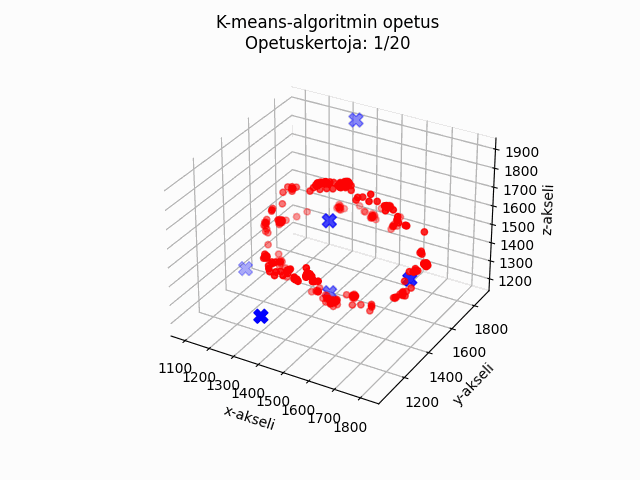

# Tietoliikenteen sovellusprojekti Syksy 2023
Projektissa tehtävänä oli suunnitella Nordic NRF5340 DK -alustalle ohjelma, joka mittasi kiihtyvyysanturidataa ja välitti tietoa langattomasti IoT-reitittimen (Raspberry Pi) kautta Oamkin MySQL-palvelimelle.

Tietokantaan tallentuvaan dataan oli TCP-sokettirajapinta ja yksinkertainen HTTP API, jonka kautta dataa haetttiin omaan kannettavaan koodatulla Python-ohjelmalla ja käsiteltiin koneoppimistarkoituksiin.  
Arkkitehtuurikuva antaa yleiskuvan projektin eri osien välisistä yhteyksistä ja toiminnallisuuksista (kuva 1).
 

<picture>
 
</picture>

*Kuva 1. Arkkitehtuurikuva projektista.*

## Kiihtyvyysanturimittaukset ja datansiirto tietokantaan

Mittaukset ja tallennus tietokantaan toteutettiin pitämällä anturia aina yhteen suuntaan kerrallaan ja samalla tälle suunnalle annettiin numero (label), joka toimii suuntatietona neuroverkolle. Annoimme vaihtelua sensoridatalle heiluttamalla anturia mittausta tehdessä (kuva 2).

#### Suunta ja label:  

x-akseli alas = 0  
x-akseli ylös = 1  
y-akseli alas = 2  
y-akseli ylös = 3  
z-akseli alas = 4  
z-akseli ylös = 5

<picture>
 
</picture>

*Kuva 2. Sensoridata 3D-avaruudessa.*

## K-means opetusalgoritmi
K-means opetusalgoritmillä tietokannasta haetusta sensoridatasta saatiin tunnistettua ja luokiteltua kaikki kuusi eri suuntaa keskipisteiden avulla. 
- Opetus (luokittelu) aloitetaan arvaamalla ensin kuusi satunnaista keskipistettä ja laskemalla kaikkien tunnettujen pisteiden etäisyys, jokaiseen arvottuun keksipisteeseen (kuva 3).  
- Jokaiselle keskipisteelle on laskuri- ja kumulatiivinen summataulukko, johon tallennetaan voittajan eli lähinnä olevan pisteen koordinaatit. Laskuria kasvatetaan aina voittajan keksipisteen kohdalla.  
- Tämän jälkeen lasketaan uudet keskipisteet kumulatiivisen summa- ja laskuriarvojen avulla (keskiarvo). Jos jokin keskipiste ei saanut yhtään voittoa, niin sille arvotaan uusi satunnainen keskipiste.  
- Tätä toistetaan niin kauan että luokittelu onnistuu (kuva 4).
- Lopputuloksena saatiin keskipisteet.h tiedosto, joka sisältää kaikki kuusi opetettua keskipistettä.  

<picture>
 
</picture>

*Kuva 3. Sensoridata ja arvotut keskipisteet.*

<picture>
 
</picture>

*Kuva 4. K-means-algoritmin opetus.* 

## Neuroverkon opetus
Neuroverkolle annettiin x,y ja z arvot sekä suuntatieto (luokka), jonka mukaan neuroverkko luokitteli x,y ja z arvot kuuteen eri luokkaan.
Neuroverkko opetettiin ja testattiin Googlen Colabissa ja sieltä tuloksena saatiin säädettävät parametrit (eli painokertoimet ja biakset), csv-tiedostoina. Erillisellä Python-koodilla ja samoja parametreja käyttämällä, saimme saman neuroverkon tuloksen kuin Colabissa käytetyllä Keras-kirjaston model.predict-funktiolla. 

<picture>
 
</picture>

*Kuva 5. Neuroverkon rakenteen suunnitelma*

<picture>
 
</picture>

*Kuva 5. Mallin rakennus Colabissa*

## Opetetun K-means-algoritmin ja neuroverkon toteutus nFR5340-alustalle ja suorityskyky mittaukset

K-means algoritmi ja neuroverkko toteutettiin NRF5340dk-alustalle, jossa molempia testattiin ottamalla 100kpl kiihtyvyysanturimittauksia, yhtä suuntaa kohden. Tuloksena tästä saatiin confusion matrix, jossa verrattiin todellisia luokkia, ennustettuihin luokkiin (kuva 6). Confusion matrix kertoo kuinka hyvin koneoppimismalli toimii, eli vastaako ennuste todellista arvoa.

<picture>
 
</picture>

*Kuva 6. Confusion matrixit tulostettuna sarjamonitorille*

Molemmat koneoppimismallit onnistuivat luokittelussa erittäin hyvällä tarkkuudella. Vastaavaan tulokseen pääseminen olisi ollut haastava toteuttaa esimerkiksi päätöspuulla, joka olisi todennäköisesti antanut epätarkemmat tulokset (raja-arvojen määrittäminen manuaalisesti on hankalaa).